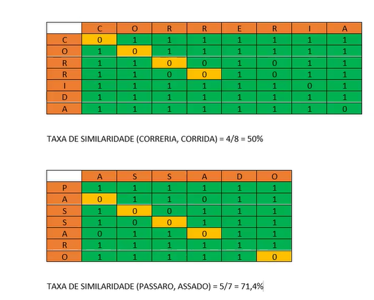
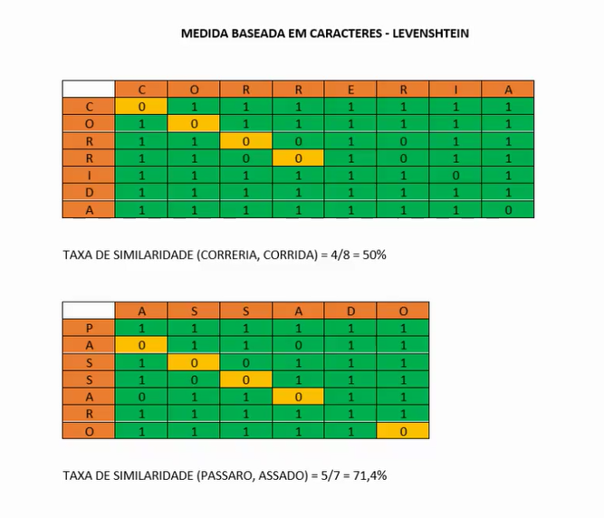

Medidas de similaridade baseada em caractere leva em consideração, cada letra, cada simbolo da palavra, e geralmente utilizam medidas de distância.

Ex: Para saber o qual similar são, comparar a forma que são escritas

CORRERIA
CORRIDA

Levenshtein: Calcula a distância entre as palavras através de uma matriz, separando a palavra letra a letra

|   | C | O | R | R | E | R | I | A |
|---|---|---|---|---|---|---|---|---|
| C | **0** | 1 | 1 | 1 | 1 | 1 | 1 | 1 | 
| O | 1 | **0** | 1 | 1 | 1 | 1 | 1 | 1 |
| R | 1 | 1 | **0** | 0 | 1 | 0 | 1 | 1 |
| R | 1 | 1 | 0 | **0** | 1 | 0 | 1 | 1 |
| I | 1 | 1 | 1 | 1 | 1 | 1 | 0 | 1 |
| D | 1 | 1 | 1 | 1 | 1 | 1 | 1 | 1 |
| A | 1 | 1 | 1 | 1 | 1 | 1 | 1 | 0 |

Linhas = 7 e Colunas = 8

TAXA de Similaridade (CORREIRA, CORRIDA) = 4/8 = 50 %

